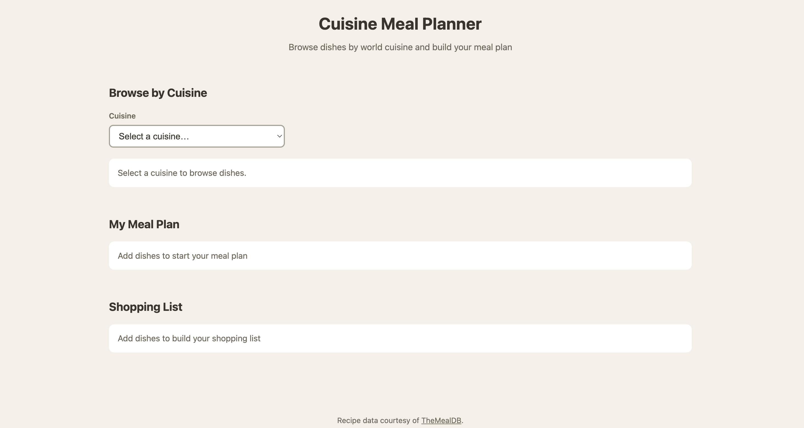

# Cuisine Meal Planner

A web app that lets you browse recipes by world cuisine, view full recipe details, build a meal plan, and generate a consolidated shopping list of all the ingredients you'll need.

## What it does

- **Browse by cuisine** — pick a cuisine and see its dishes in a card grid
- **View details** — click any dish to open a modal with its category, ingredients, and full instructions
- **Build a meal plan** — add dishes (including the same dish more than once) to your plan
- **Consolidated shopping list** — automatically combines ingredients across every dish in your plan, deduplicates them, and intelligently sums quantities that share a unit (e.g. grams), falling back to listing measures separately when they can't be cleanly combined

## API

Built with [TheMealDB](https://www.themealdb.com/api.php) — a free recipe API (using the free educational test key). No API key setup required.

## Live site

[https://sabuissa.github.io/meal-prep/](https://sabuissa.github.io/meal-prep/)

## Screenshot

## Built with

- Vanilla HTML, CSS, and JavaScript (no frameworks)
- The Fetch API for live data
- Deployed on GitHub Pages

## Known limitations

- Ingredient quantities are only summed when they share a recognized metric unit (g, kg, ml, l); other measures are listed separately, since the source data stores them as free text.
- The number of dishes per cuisine is limited by TheMealDB's free tier.
- No macros listed for tracking purposes.